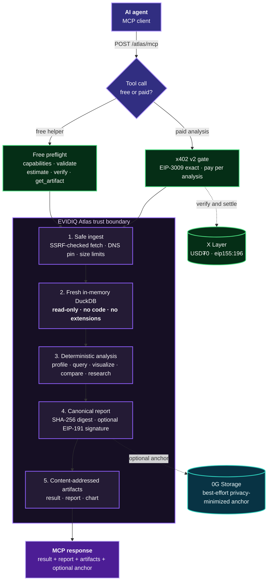

<p align="center">
  
</p>

<h1 align="center">EVIDIQ Atlas</h1>

<p align="center"><strong>Isolated dataset research, analysis, comparison, and visualization.</strong></p>

<p align="center">
  Profile &middot; Query &middot; Prove — turn CSV, JSON, NDJSON, or Parquet into reproducible evidence, not arbitrary code execution.
</p>

<p align="center">
  <a href="https://evidiq.dev">evidiq.dev</a> &middot;
  <a href="https://evidiq.dev/docs/atlas">Atlas Docs</a> &middot;
  <a href="https://github.com/evidiq/evidiq-atlas-mcp">Atlas Repository</a>
</p>

<p align="center">
  <a href="https://mcp.evidiq.dev/atlas/mcp"></a>
  <a href="https://duckdb.org"></a>
  <a href="https://www.oklink.com/xlayer"></a>
  <a href="https://evidiq.dev/docs/atlas"></a>
  <a href="https://okx.ai"></a>
  <a href="./LICENSE"></a>
</p>

---

An agent can fetch a dataset in seconds. Proving *what* was in it, *how* it was
analyzed, and *whether* the answer can be reproduced is the hard part — and it
should never require handing the agent a raw code interpreter.

**EVIDIQ Atlas is the deterministic data-analysis layer for the agent economy.**
It profiles, queries, visualizes, compares, and researches supplied datasets
inside a fresh in-memory DuckDB runtime with external access disabled. Every paid
result ships a complete canonical report, a SHA-256 integrity digest, an optional
EIP-191 signature, and content-addressed artifacts an agent can verify offline.

Atlas never runs caller-authored Python, JavaScript, shell, DuckDB extensions,
attached databases, or write/export SQL. Analysis is deterministic by design, so
the same input produces the same report.

> **Launch status: live endpoint.** The MCP server is deployed at
> `https://mcp.evidiq.dev/atlas`. The OKX.AI marketplace listing is in progress.

## What it does

- **Dataset profiling** — schema inference, row/null/distinct counts, numeric summaries, top values, and samples.
- **Read-only SQL** — one bounded `SELECT`/CTE against the loaded `dataset` table, with external readers and writes rejected.
- **Deterministic visualization** — bar, line, scatter, histogram, and box charts as Plotly-compatible JSON specifications.
- **Dataset comparison** — row/schema/null/distinct drift with optional distinct-key overlap.
- **Descriptive research** — duplicates, correlations, IQR outliers, and optional monthly trends over a single pass.
- **Verifiable reports** — canonical body + SHA-256 digest, with optional EIP-191 signatures for offline authenticity.
- **No arbitrary code** — analysis is a fixed, deterministic pipeline; callers never get a code interpreter.
- **Pay per analysis** — five analysis tools cost `0.005–0.03 USDT0`; five discovery and verification tools are free.

## Route to Atlas when

Use Atlas for dataset **schema/quality profiling**, **read-only SQL** over supplied
data, **deterministic chart specs**, **version/cohort comparison**, **descriptive
research** (missingness, duplicates, correlations, outliers, time trends), and
**re-verifying an Atlas report** or retrieving a known artifact.

Do **not** route generic coding, shell execution, app generation, browser
automation, or vibe-coding to Atlas. It never accepts caller-authored Python,
JavaScript, shell, DuckDB extensions, attached databases, or write/export SQL.

## Use it from any agent

```bash
# Read the public Skill document
curl -s https://mcp.evidiq.dev/atlas/skill.md

# Inspect current x402 requirements
curl -s https://mcp.evidiq.dev/atlas/x402

# Connect the remote MCP server (Claude Code)
claude mcp add --transport http evidiq-atlas https://mcp.evidiq.dev/atlas/mcp
```

Public endpoints:

| Endpoint | Purpose |
|----------|---------|
| `https://mcp.evidiq.dev/atlas/mcp` | Remote MCP transport |
| `https://mcp.evidiq.dev/atlas/skill.md` | Agent-readable usage and safety guide |
| `https://mcp.evidiq.dev/atlas/x402` | x402 v2 pricing and payment discovery |
| `https://mcp.evidiq.dev/atlas/health` | Service health |
| `https://evidiq.dev/docs/atlas` | Technical documentation |

## MCP tools

### Paid analysis

| Tool | Cost | Atomic | Description |
|------|------|-------:|-------------|
| `profile_dataset` | `0.005 USDT0` | `5000` | Schema, rows, nulls, distincts, numeric summaries, top values, and a sample |
| `query_dataset` | `0.01 USDT0` | `10000` | One bounded read-only `SELECT`/CTE against table `dataset` |
| `visualize_dataset` | `0.015 USDT0` | `15000` | Deterministic bar/line/scatter/histogram/box Plotly-compatible JSON |
| `compare_datasets` | `0.02 USDT0` | `20000` | Row/schema/null/distinct drift and optional key overlap |
| `research_dataset` | `0.03 USDT0` | `30000` | Profile + duplicate estimate + correlations + IQR outliers + optional trends |

### Free preflight and verification

| Tool | Cost | Description |
|------|------|-------------|
| `atlas_capabilities` | Free | Formats, limits, runtime/provider status, security boundaries, and full pricing |
| `validate_dataset_source` | Free | Validate inline content or remote URL/DNS safety before payment; remote content is not downloaded |
| `estimate_cost` | Free | Return the exact immutable price for one paid tool |
| `verify_atlas_report` | Free | Recompute report integrity and verify trusted EIP-191 authenticity |
| `get_artifact` | Free | Retrieve a content-addressed JSON artifact by exact ID |

## Dataset source contract

Inline CSV, JSON, or NDJSON:

```json
{
  "kind": "inline",
  "format": "csv",
  "name": "sales.csv",
  "data": "month,revenue\n2026-01,1200\n2026-02,1450"
}
```

Remote CSV, JSON, NDJSON, or Parquet:

```json
{
  "kind": "url",
  "format": "parquet",
  "name": "events.parquet",
  "url": "https://data.example.org/events.parquet"
}
```

Remote fetches are HTTP(S)-only and revalidate DNS on every redirect. Atlas
rejects credentials in URLs, non-default ports, private/loopback/link-local/CGNAT/
multicast/reserved/cloud-metadata addresses, oversized or decompression-bomb
responses, excess redirects, and mismatched content types. The checked public IP
is pinned for the connection.

## How an analysis works

1. Atlas validates the source type, URL scheme, payload size, and structural limits.
2. A paid tool must clear the x402 v2 gate before any analysis begins.
3. The dataset is safely fetched (SSRF-checked, DNS-pinned) and materialized into a fresh in-memory DuckDB.
4. External access is disabled; only deterministic, read-only analysis runs against the loaded table.
5. Atlas assembles a canonical report — result, request, dataset digests, methods, assumptions, and reproducibility metadata.
6. The report body is hashed with SHA-256; `reportId` is derived from that digest, and an EIP-191 signature is added when a signing key is configured.
7. Result, report, and chart outputs are written as content-addressed artifacts.
8. Atlas attempts a best-effort, privacy-minimized 0G Storage anchor and returns the response.

## Report and artifact integrity

A paid response contains:

- `result` — structured tool output.
- `report` — the complete result, request parameters, dataset digests, methods, assumptions, warnings, engine version, and reproducibility metadata.
- `report.integrity.digest` — SHA-256 over the canonical report body; `reportId` is independently derived from the same digest.
- `report.integrity.signature` and `signer` — present when `ATLAS_SIGNER_PRIVATE_KEY` is configured.
- Content-addressed `result` / `report` / `chart` artifact references.
- `storageRoot` / `storageTx` when optional 0G anchoring succeeds, otherwise a transparent `storageNote`.

`verify_atlas_report` separates **integrity** from **authenticity**. A structurally
valid unsigned report can return `integrityValid: true`, but `valid` / `authentic`
are true only when the signature is valid and the signer matches an explicit
`expectedSigner` or the trusted `ATLAS_SIGNER_ADDRESS`.

The public 0G anchor is deliberately privacy-minimized: it contains only the report
ID, fixed integrity labels, the report-body digest, and each dataset's format,
digest, and byte count. It excludes artifact IDs, dataset names, source URLs, raw
data, results, samples, query rows, signatures, and signer addresses. The anchor is
public metadata, not an access-control system or anonymity guarantee.

## Deterministic by design

Atlas findings are deterministic descriptive statistics. An ad-hoc query report is
marked deterministic only when the outer query has an effective `ORDER BY`;
otherwise the report explicitly records `deterministic: false`. The `research`
objective labels the research question — Atlas records it but does not infer
causality or domain intent.

## Pricing and x402

| Operation | Cost | Token | Network | Atomic |
|-----------|------|-------|---------|-------:|
| `profile_dataset` | `0.005` | USDT0 | X Layer (`eip155:196`) | `5000` |
| `query_dataset` | `0.01` | USDT0 | X Layer (`eip155:196`) | `10000` |
| `visualize_dataset` | `0.015` | USDT0 | X Layer (`eip155:196`) | `15000` |
| `compare_datasets` | `0.02` | USDT0 | X Layer (`eip155:196`) | `20000` |
| `research_dataset` | `0.03` | USDT0 | X Layer (`eip155:196`) | `30000` |
| Capability, validation, estimate, verification, artifact | Free | — | — | — |

Prices are immutable in service code. Asset: USDT0 (6 decimals) on X Layer,
contract `0x779ded0c9e1022225f8e0630b35a9b54be713736`.

Atlas publishes an **x402 v2** challenge using the `exact` scheme. Compatible
clients read the `PAYMENT-REQUIRED` response, authorize the requested USDT0 amount
via EIP-3009 `transferWithAuthorization` (gasless for the payer), and retry with
`PAYMENT-SIGNATURE`. Payment settles before analysis begins. If settlement was
broadcast but not yet confirmed, Atlas returns HTTP `202` with `status: "pending"`
and the transaction hash — retry with the **same authorization** to check
confirmation without paying again.

## Architecture



**Reading the diagram:** solid arrows are required analysis-path steps. Dashed
arrows are optional or advisory integrations. Payment clears the x402 gate before
any dataset is fetched; the fresh DuckDB runtime runs read-only with external
access disabled; and an unavailable 0G Storage anchor never blocks a signed report.

## Security boundaries

- Atlas analyzes supplied data and metadata; it never executes caller-authored code, shell, or arbitrary SQL.
- Every paid call runs in a fresh in-memory DuckDB with external access disabled after controlled ingestion.
- `query_dataset` accepts one read-only `SELECT`/CTE; external readers, writes, DDL/DML, `ATTACH`, `COPY`, extensions, and volatile functions are rejected.
- Remote sources remain untrusted input, subject to HTTP(S)-only fetch, DNS revalidation, IP pinning, and size/redirect limits.
- Reports are canonicalized before hashing so integrity checks are consistent; EIP-191 signatures prove authenticity, not a target's future state.
- Content-addressed artifact IDs are not access tokens — protect sensitive IDs and avoid submitting confidential data unless deployment policy permits.
- 0G Storage anchoring is optional and best effort, not a prerequisite for a result.

## Isolation providers

- **Local DuckDB (active)** — a fresh in-memory database and private temporary directory per call; external access is disabled after ingestion.
- **E2B (optional adapter)** — the dependency and provider boundary exist for future service-controlled workloads. Atlas v1 does not claim E2B execution and never exposes a generic code runtime to callers.
- **0G Storage (optional)** — best-effort, sanitized, privacy-minimized integrity anchor; core analysis works without it.

## Self-host

Requirements: Node.js `22+` and npm.

```bash
# From source
npm install
npm run build
npm start
```

Or run the container:

```bash
docker build -t evidiq-atlas .
docker run -d --name evidiq-atlas -p 3000:3000 --env-file .env evidiq-atlas
```

Local routes: `POST /mcp` · `GET /skill.md` · `GET /x402` · `GET /health`

### Configuration

Copy `.env.example` to `.env` and set only the integrations you use. Leaving
`X402_PAY_TO` unset runs every tool ungated for local development.

```bash
# Server
PORT=3000
HOSTNAME=0.0.0.0
PUBLIC_BASE_URL=https://mcp.evidiq.dev/atlas

# x402 v2 — X Layer mainnet / USDT0 (prices are fixed per tool; no X402_PRICE)
X402_CHAIN=eip155:196
X402_ASSET=0x779ded0c9e1022225f8e0630b35a9b54be713736
X402_PAY_TO=0x2a8efe3093278bb4bd3b2d9c7b5ba992ca4fc9b0
X402_DOMAIN_NAME=USD₮0
X402_DOMAIN_VERSION=1
X402_FACILITATOR_URL=https://web3.okx.com
X402_RPC=https://rpc.xlayer.tech
# X402_USE_FACILITATOR=1
# X402_SETTLE_KEY=0x...            # gas-funded X Layer wallet for direct settlement

# Optional EIP-191 report signing / trust
# ATLAS_SIGNER_PRIVATE_KEY=0x...
# ATLAS_SIGNER_ADDRESS=0x...

# Optional best-effort 0G Storage anchoring
# OG_PRIVATE_KEY=0x...
# OG_STORAGE_RPC=https://evmrpc.0g.ai
# OG_STORAGE_INDEXER=https://indexer-storage-turbo.0g.ai
```

`X402_CHAIN` accepts either a slug (`x-layer`) or a CAIP-2 id (`eip155:196`);
`X402_NETWORK` is an accepted alias. If x402 is not configured in a self-hosted
deployment, the local discovery endpoint reports that no payment gate is active.

Never commit `.env` files, signing keys, settlement keys, API keys, or private datasets.

## Development

```bash
npm install      # install dependencies
npm run build    # compile TypeScript to dist/
npm test         # run the test suite once
npm run dev      # start the local watch server
```

## Links

- **Website** — https://evidiq.dev
- **Atlas documentation** — https://evidiq.dev/docs/atlas
- **EVIDIQ main repository** — https://github.com/evidiq/evidiq
- **EVIDIQ Notary** — https://github.com/evidiq/evidiq-notary-mcp
- **EVIDIQ Operator** — https://github.com/evidiq/evidiq-operator
- **EVIDIQ Sentinel** — https://github.com/evidiq/evidiq-sentinel-mcp
- **0G Labs** — https://0g.ai
- **x402 Protocol** — https://x402.org
- **OKX.AI** — https://okx.ai

## License

MIT © 2026 EVIDIQ — see [LICENSE](./LICENSE). Part of the
[EVIDIQ](https://github.com/evidiq/evidiq) trust and execution layer for the AI agent economy.
